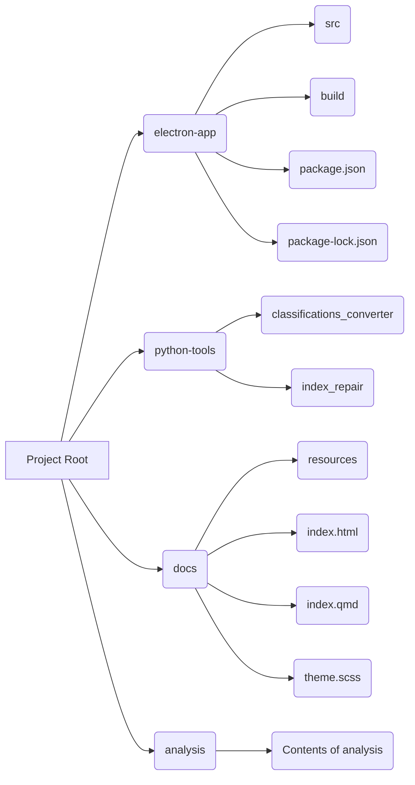

# Reorganization Plan

## Goal

To reorganize the codebase to make it cleaner for future Electron app development.

## Proposed Reorganization Plan

## Explanation

*   **electron-app:** This directory will contain all the core Electron app files, including `src`, `build`, `package.json`, and `package-lock.json`.
*   **python-tools:** This directory will contain all the Python scripts, such as `classifications_converter` and `index_repair`.
*   **docs:** This directory will contain all the documentation files, including `resources`, `index.html`, `index.qmd`, and `theme.scss`.
*   **analysis:** This directory will contain all the analysis files, including the R scripts and data.

## Detailed Steps

1.  **Create a new branch:** Create a new branch for the reorganization to avoid disrupting the main codebase.
2.  **Create new directories:** Create the `electron-app`, `python-tools`, `docs`, and `analysis` directories at the project root.
3.  **Move Electron app files:** Move all the core Electron app files to the `electron-app` directory.
4.  **Move Python scripts:** Move all the Python scripts to the `python-tools` directory.
5.  **Move documentation:** Move the `resources`, `index.html`, `index.qmd`, and `theme.scss` files to the `docs` directory.
6.  **Move analysis files:** Move *the contents of* the `analysis` directory to the `analysis` directory.
7.  **Update paths:** Update any file paths in the codebase to reflect the new directory structure.
8.  **Test the application:** Test the application to ensure that everything is working as expected.
9.  **Commit the changes:** Commit the changes to the new branch.
10. **Create a pull request:** Create a pull request to merge the changes into the main codebase.